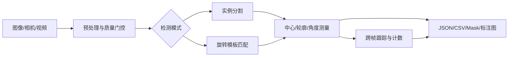

# FlexPose Vision

轻量级工业目标分割、二维姿态估计与产线计数工具。项目以 OpenCV 为核心，覆盖离线批处理、旋转模板匹配、实例测量、实时跟踪、K230 模板导出和桌面操作界面，适合前景可分、姿态变化可控的工业场景。

## 核心能力

- 阈值、自适应阈值、颜色范围和 Watershed 四类分割后端
- PCA/最小旋转矩形中心与无方向长轴角度估计
- 旋转、尺度感知的多模板匹配与跨模板候选抑制
- 不规则目标 Mask 编辑、质量检查和模板库管理
- 相机/视频实时检测、质量门控、目标跟踪和过线计数
- JSON、CSV、逐实例 Mask、标注图和调试图导出
- 电脑端模板验证及 K230 SD 卡部署包生成
- 合成数据、基准测试和自动化测试

## 适用边界

该项目优先解决二维定位、角度测量、识别与计数，不将相关性得分解释为表面缺陷概率。强透视、严重遮挡、非刚性大形变或低对比场景需要重新标定参数，必要时可通过统一分割接口接入 ONNX 或深度学习模型。

## 快速开始

需要 Python 3.10+。

```bash
git clone https://github.com/orge-e/industrial-segpose.git
cd industrial-segpose
pip install -e .
```

启动桌面工作台：

```bash
python -m industrial_segpose.template_ui
```

运行单图分割与姿态估计：

```bash
python -m industrial_segpose infer \
  --input samples/generated/separated/separated.png \
  --config configs/default.yaml \
  --output outputs
```

目录批处理：

```bash
python -m industrial_segpose infer \
  --input samples/generated \
  --recursive \
  --config configs/default.yaml \
  --output outputs \
  --save-debug
```

## 处理流程



## 模板工作流

1. 从基准图中导入或框选目标。
2. 使用多边形、画笔或自动算法修正有效 Mask。
3. 设置名称、阈值、角度和尺度范围并保存到模板库。
4. 用独立场景图批量验证模板。
5. 在实时生产页执行定位、分类、跟踪与过线计数。

角度表示目标相对模板的旋转量，规范到 `[-180°, 180°)`；实例分割模式的无方向长轴角度规范到 `[0°, 180°)`。近圆形或近正方形目标会降低 `angle_reliable`，不会把几何置信度伪装成概率。

## K230 部署

电脑端负责建立、修正和验证模板库，K230 负责加载部署包并执行轻量推理。生成部署目录：

```powershell
python -m industrial_segpose.k230_deploy `
  --project . `
  --output build/k230_sdcard `
  --overwrite
```

生成结果位于 `build/k230_sdcard/industrial_vision/`。部署程序默认不会控制执行机构，也不会自动覆盖 SD 卡启动文件。

## 输出结构

```text
outputs/run_<timestamp>/
  annotated/       标注图
  masks/           实例二值 Mask
  labels/          彩色标签图
  debug/           预处理与中间结果
  json/            单图结构化结果
  csv/results.csv  实例结果总表
  run_summary.json 批次摘要
```

## 验证

```bash
python scripts/generate_synthetic_samples.py --output samples/generated
python -m pytest
python scripts/benchmark.py --data samples/generated --config configs/default.yaml
```

合成数据用于验证软件链路，不代表真实产线精度。正式部署前应使用固定现场数据集评估定位误差、角度误差、计数准确率、失败率与处理耗时。

## 技术栈

- Python 3.10+
- OpenCV / NumPy / PyYAML
- PySide6 桌面界面
- pytest
- K230 MicroPython 运行时适配

## 许可

本项目采用 MIT License，详见 [LICENSE](LICENSE)。
