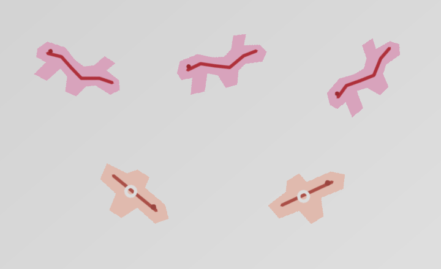

# Industrial SegPose

工业目标分割、二维位姿测量与轻量化生产视觉工具。

Industrial SegPose 是一个基于 OpenCV 的工业视觉项目，面向规则或半规则工件的实例分割、中心定位、二维方向测量、模板匹配、实时计数与 K230 边缘部署。项目强调可测试、可配置和模块化，不依赖 PyTorch 即可运行核心流程。

> 当前版本：`v0.9.3` · Python 3.10+ · OpenCV · PyYAML



## 核心能力

- **实例分割**：支持全局阈值 / Otsu、自适应阈值、HSV/Lab 颜色范围与 marker-based Watershed。
- **二维位姿测量**：输出目标中心 `(x, y)`、无方向长轴角度 `θ`、轮廓、旋转矩形与角度可靠性。
- **目标过滤**：按面积、尺寸、长宽比、圆度和边界接触状态过滤，并保留拒绝原因。
- **模板匹配 UI**：支持 ROI 建模、Mask 修正、多模板工件库、旋转/尺度搜索和分类结果导出。
- **实时生产模式**：相机/视频输入、质量门控、跨帧轨迹关联、计数线与分类累计。
- **K230 工作流**：电脑端建立和验证模板，导出可复制到 SD 卡的 K230 部署包。
- **工程化输出**：支持单图/目录批处理，输出标注图、Mask、JSON、CSV、调试图和运行摘要。
- **测试与评估**：包含 pytest、合成数据生成、基准测试及 K230 离线验证工具。

## 适用场景

项目适合以下工业视觉任务：

- 工件分离、计数与中心定位
- 工件二维方向 / 长轴角度估计
- 外观稳定目标的旋转感知模板匹配
- 传送带实时计数与分类统计
- PC 端模板建模后部署到 K230 的轻量边缘视觉流程

对于严重遮挡、强透视、大幅非刚性形变或需要语义学习的场景，应考虑 YOLO Segmentation、Mask R-CNN、ONNX 模型等学习型后端。

## 快速开始

### 1. 安装

```bash
git clone https://github.com/orge-e/industrial-segpose.git
cd industrial-segpose

pip install -r requirements.txt
# 或开发模式
pip install -e .
```

### 2. 命令行推理

单张图像：

```bash
python -m industrial_segpose infer \
  --input samples/generated/separated/separated.png \
  --config configs/default.yaml \
  --output outputs
```

目录批处理：

```bash
python -m industrial_segpose infer \
  --input samples/generated \
  --recursive \
  --config configs/default.yaml \
  --output outputs \
  --save-debug
```

### 3. 启动模板匹配桌面工具

```bash
python -m industrial_segpose.template_ui
```

安装项目后也可直接运行：

```bash
industrial-segpose-ui
```

## 坐标与角度定义

图像坐标原点位于左上角，x 向右、y 向下。

姿态定义为：

```text
(x, y, θ)
```

其中 `θ` 表示目标无方向长轴相对图像水平向右方向的角度，统一到 `[0°, 180°)`。例如 10° 与 190° 表示同一条无方向轴。

近圆形、正方形或主方向不明显的对象仍可输出角度，但 `angle_reliable` 可能为 `false`。该可靠性来自几何特征，不代表概率置信度。

## 项目结构

```text
industrial-segpose/
├─ industrial_segpose/   # PC 端核心算法、CLI 与桌面 UI
├─ configs/              # 分割、测量与运行配置
├─ k230_runtime/         # K230 板端运行代码
├─ shared_protocol/      # PC / K230 共享协议
├─ scripts/              # 数据生成、评估和辅助脚本
├─ tests/                # 自动化测试
├─ samples/              # 示例与演示素材
├─ templates/            # 模板库
├─ docs/                 # 开发与工作流文档
└─ reports/              # 验证与实验报告
```

核心 PC 管线进一步按 I/O、预处理、分割、过滤、测量、可视化和 pipeline 分层，便于替换分割后端而保持测量与输出接口稳定。

## 输出结果

每次 CLI 运行会创建独立输出目录，例如：

```text
outputs/run_YYYYMMDD_HHMMSS_ffffff/
├─ annotated/
├─ masks/
├─ labels/
├─ debug/
├─ json/
├─ csv/results.csv
└─ run_summary.json
```

输出可用于人工复核、Excel 分析或下游程序集成。

## 测试与评估

```bash
python -m pytest
python scripts/generate_synthetic_samples.py --output samples/generated
python scripts/benchmark.py --data samples/generated --config configs/default.yaml
```

## K230 部署

生成可复制到 SD 卡的部署目录：

```powershell
python -m industrial_segpose.k230_deploy --project . --output build/k230_sdcard --overwrite
```

默认流程采用：

```text
PC 建立/修正模板
        ↓
批量离线验证
        ↓
导出 K230 模板与配置
        ↓
生成部署包
        ↓
复制至 SD 卡
        ↓
K230 执行检测
```

更完整的 K230 开发说明见 [docs/k230_development.md](docs/k230_development.md)。

## 进一步文档

- [模板匹配与生产工作流](docs/template_and_production_workflows.md)
- [K230 开发与部署](docs/k230_development.md)

## 当前限制

- 传统阈值与 Watershed 更适合前景/背景可区分、轻度粘连的场景。
- Otsu 在强非均匀光照或低对比材质下可能失效，需要重新选择预处理或分割策略。
- 近圆形、正方形和明显非刚性目标的主方向可能不稳定。
- 当前核心位姿结果是二维图像坐标；如需毫米坐标或机械臂坐标，需要额外完成相机标定与坐标变换。
- 模板匹配假设拍摄尺度、成像条件和目标外观相对稳定。

## License

MIT License.
